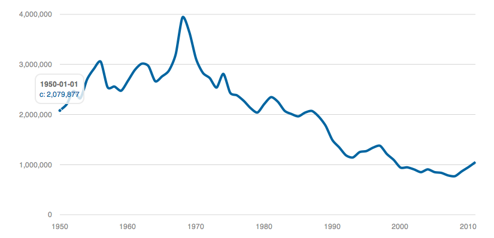
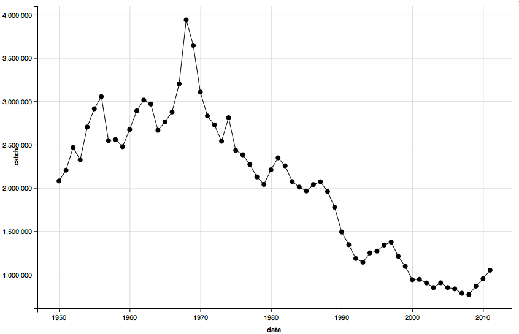

# Use case 1 - Making interactive charts in R

## Setup

Install `rCharts`

```{r eval=FALSE}
install.packages("devtools")
devtools::install_github('ramnathv/rCharts')
```

Install `ggvis`

```{r eval=FALSE}
install.packages("ggvis")
```

Install `rnoaa` and `rfisheries` 

```{r eval=FALSE}
install.packages("rfisheries")
```

Load packages

```{r}
library('rCharts')
library('ggvis')
# library('rnoaa')
library('rfisheries')
```

## Get some data

Here, we search for cod landings data from [Openfisheries.org](http://openfisheries.org/)

```{r}
# res <- ncdc(datasetid='GHCND', locationid='FIPS:AS', datatypeid='PRCP', startdate = '2013-10-01', enddate = '2013-12-01', limit = 500)
cod <- of_landings(species = "COD")
```

## rCharts

```{r eval=FALSE}
cod$date <- paste0(cod$year, "-01", "-01")
cod_plot <- mPlot(x = "date", y = "catch", type = "Line", data = cod)
cod_plot$set(pointSize = 0, lineWidth = 4)
cod_plot
```



## ggvis

```{r eval=FALSE}
cod <- of_landings(species = "COD")
cod$date <- paste0(cod$year, "-01", "-01")
cod$date <- as.Date(cod$date)
cod %>% 
  ggvis(~date, ~catch) %>%
  layer_points %>%
  layer_lines %>%
  add_tooltip(function(x) x$catch)
```



> Note: the above charts are interactive when you run the code, but are static for the demo output file.
